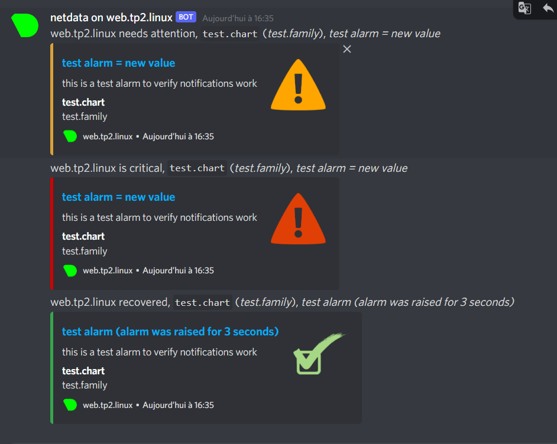

# TP2 pt. 2 : Maintien en condition opérationnelle

- [TP2 pt. 2 : Maintien en condition opérationnelle](#tp2-pt-2--maintien-en-condition-opérationnelle)
- [1. Monitoring](#1-monitoring)
  - [I. Install de NetData :](#i-install-de-netdata-)
    - [**Alertes netdata :**](#alertes-netdata-)
- [2. Backup](#2-backup)
  - [I. Install et config de NFS :](#i-install-et-config-de-nfs-)
    - [**Setup de l'environment :**](#setup-de-lenvironment-)
    - [**Setup du partage NFS :**](#setup-du-partage-nfs-)
    - [**Setup des point de montage sur `web.tp2.linux`**](#setup-des-point-de-montage-sur-webtp2linux)

# 1. Monitoring 

## I. Install de NetData :  

Après l'install on regarde le service netdata qui viens d'être créé :

> Service actif ?

```
[lack@web ~]$ sudo systemctl status netdata
● netdata.service - Real time performance monitoring
   Loaded: loaded (/usr/lib/systemd/system/netdata.service; enabled; vendor preset: disabled)
   Active: active (running) since Mon 2021-10-11 14:45:52 CEST; 3min 8s ago
  Process: 2141 ExecStartPre=/bin/chown -R netdata:netdata /opt/netdata/var/run/netdata (code=exited, status=0/SUCCESS)
  Process: 2139 ExecStartPre=/bin/mkdir -p /opt/netdata/var/run/netdata (code=exited, status=0/SUCCESS)
  Process: 2137 ExecStartPre=/bin/chown -R netdata:netdata /opt/netdata/var/cache/netdata (code=exited, status=0/SUCCES>
  Process: 2136 ExecStartPre=/bin/mkdir -p /opt/netdata/var/cache/netdata (code=exited, status=0/SUCCESS)
 Main PID: 2143 (netdata)
    Tasks: 31 (limit: 4947)
   Memory: 43.4M
   CGroup: /system.slice/netdata.service
   [...]
```

> Service qui s'execute au démarrage ?

```
[lack@web ~]$ sudo systemctl is-enabled netdata
enabled
```

On regarde sur quel port netdata écoute :  

```
[lack@web ~]$ sudo ss -alnpt
State          Recv-Q          Send-Q                   Local Address:Port                    Peer Address:Port         Process
LISTEN         0               128                            0.0.0.0:19999                        0.0.0.0:*             users:(("netdata",pid=2143,fd=5))
LISTEN         0               128                            0.0.0.0:22                           0.0.0.0:*             users:(("sshd",pid=836,fd=5))
LISTEN         0               128                          127.0.0.1:8125                         0.0.0.0:*             users:(("netdata",pid=2143,fd=35))
LISTEN         0               128                               [::]:19999                           [::]:*             users:(("netdata",pid=2143,fd=6))
LISTEN         0               128                                  *:80                                 *:*             users:(("httpd",pid=2371,fd=4),("httpd",pid=866,fd=4),("httpd",pid=864,fd=4),("httpd",pid=863,fd=4),("httpd",pid=832,fd=4))
LISTEN         0               128                               [::]:22                              [::]:*             users:(("sshd",pid=836,fd=7))
LISTEN         0               128                              [::1]:8125                            [::]:*             users:(("netdata",pid=2143,fd=34))
[
```

On remarque que netdata écoute sur le port `19999/tcp`, on autorise donc ce port dans le firewall :  

```
[lack@web ~]$ sudo firewall-cmd --zone=public --permanent --add-port=19999/tcp
success
[lack@web ~]$ sudo firewall-cmd --reload
success
[lack@web ~]$ sudo firewall-cmd --list-all
public (active)
  target: default
  icmp-block-inversion: no
  interfaces: enp0s3 enp0s8
  sources:
  services: cockpit dhcpv6-client ssh
  ports: 80/tcp 19999/tcp
  protocols:
  masquerade: no
  forward-ports:
  source-ports:
  icmp-blocks:
  rich rules:
```

### **Alertes netdata :**  

Configuration pour lier a discord :  

```
# discord (discordapp.com) global notification options

# multiple recipients can be given like this:
#                  "CHANNEL1 CHANNEL2 ..."

# enable/disable sending discord notifications
SEND_DISCORD="YES"

# Create a webhook by following the official documentation -
# https://support.discordapp.com/hc/en-us/articles/228383668-Intro-to-Webhooks
DISCORD_WEBHOOK_URL="https://canary.discord.com/api/webhooks/897106362847342592/XXXXXXXXXXXXXXXXXXXXXXXXXXXXXXXXXXXXXXXX"

# if a role's recipients are not configured, a notification will be send to
# this discord channel (empty = do not send a notification for unconfigured
# roles):
DEFAULT_RECIPIENT_DISCORD="monitoring-serv-tp"
```


---

# 2. Backup 

## I. Install et config de NFS :  

### **Setup de l'environment :**  

On créer un dossier par machine dans `/srv/backups` :  

```
[lack@backup backup]$ ls -la
total 0
drwxr-xr-x. 4 root root 47 Oct 12 15:15 .
drwxr-xr-x. 3 root root 20 Oct 11 18:03 ..
drwxr-xr-x. 2 root root  6 Oct 12 15:15 db.tp2.linux
drwxr-xr-x. 2 root root  6 Oct 12 14:29 web.tp2.linux
```
### **Setup du partage NFS :**

Configuration du domaine :  

```
[lack@backup backup]$ sudo cat /etc/idmapd.conf | grep Domain
#Domain = tp2.linux
```

Configuration du partage NFS pour le dossier `/srv/backup/` :  

```
[lack@backup backup]$ sudo cat /etc/exports
/srv/backup/web.tp2.linux 10.102.1.0/24(rw,no_root_squash)
```

### **Setup des point de montage sur `web.tp2.linux`**

Après le setup on monte le tout et on regarde le partage fonctionne correctement :  

```
[lack@web ~]$ sudo mount -t nfs backup.tp2.linux:/srv/backup/web.tp2.linux /srv/backup
[lack@web ~]$ df -hT
Filesystem                                 Type      Size  Used Avail Use% Mounted on
devtmpfs                                   devtmpfs  387M     0  387M   0% /dev
tmpfs                                      tmpfs     405M  324K  405M   1% /dev/shm
tmpfs                                      tmpfs     405M  5.6M  400M   2% /run
tmpfs                                      tmpfs     405M     0  405M   0% /sys/fs/cgroup
/dev/mapper/rl-root                        xfs       6.2G  4.1G  2.2G  66% /
/dev/sda1                                  xfs      1014M  300M  715M  30% /boot
tmpfs                                      tmpfs      81M     0   81M   0% /run/user/1000
backup.tp2.linux:/srv/backup/web.tp2.linux nfs4      6.2G  2.3G  3.9G  38% /srv/backup
[lack@web ~]$ ls /srv/backup/
test1.t
```
> Normalement, test1.t sera aussi dans le `/srv/backup/web.tp2.linux` de la machine backup.

```
[lack@backup web.tp2.linux]$ ls
test1.t
```

> On veut que le NFS se monte au démarrage avec `/etc/fstab` :  

```
[lack@backup web.tp2.linux]$ sudo cat /etc/fstab | grep srv
backup.tp2.linux:/srv/backup/web.tp2.linux /srv/backup               nfs     defaults        0 0
```