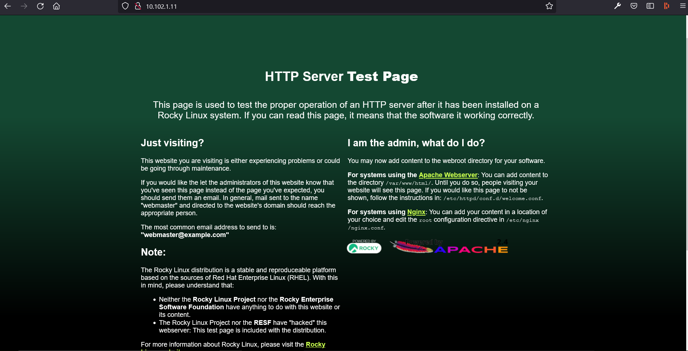
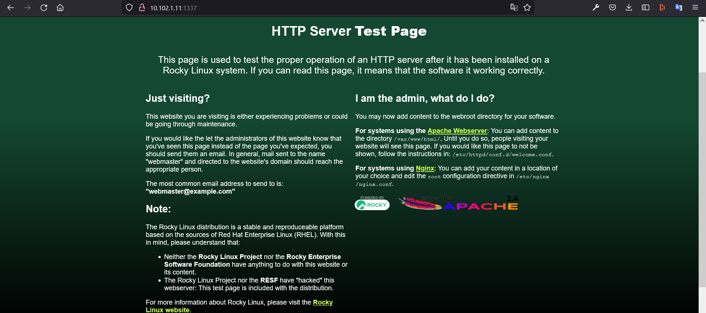
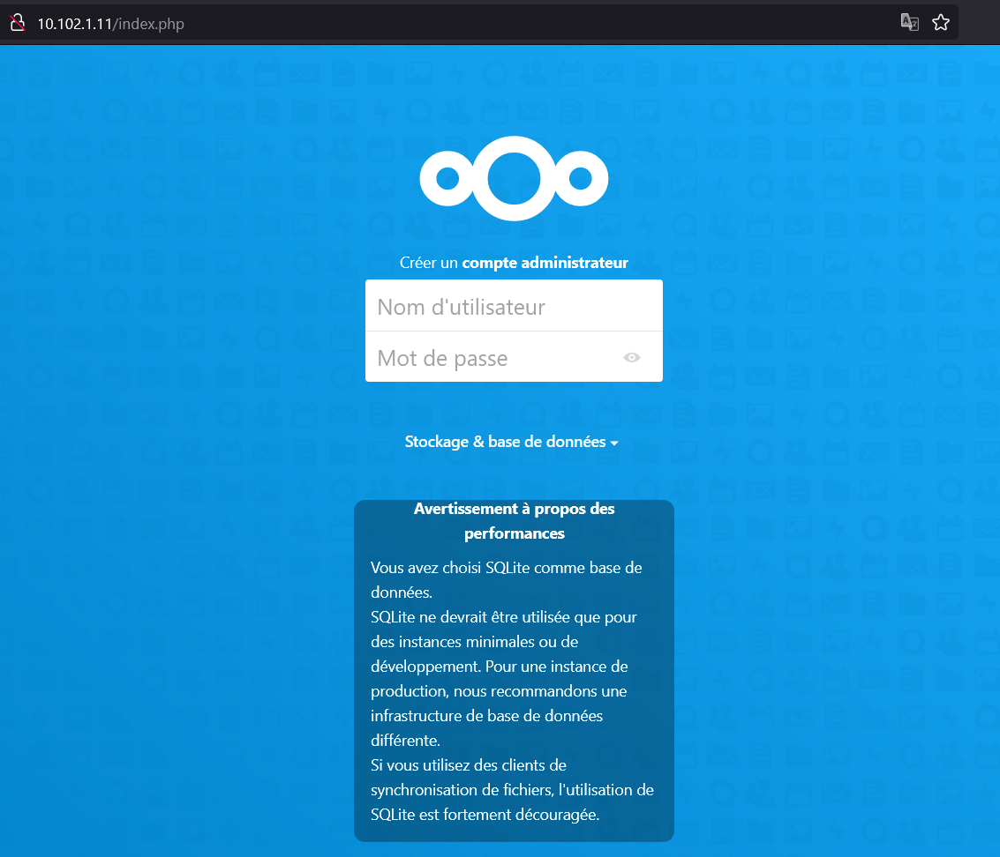

# TP2 -- Linux Part 1. Gestion de service

- [TP2 -- Linux Part 1. Gestion de service](#tp2----linux-part-1-gestion-de-service)
- [1. Un premier serveur Web](#1-un-premier-serveur-web)
  - [A. Installation](#a-installation)
  - [B. Maitriser le service :](#b-maitriser-le-service-)
- [2. Une stack web plus avancée](#2-une-stack-web-plus-avancée)
  - [A. Setup du serveur Web :](#a-setup-du-serveur-web-)
    - [**Installation des Repos :**](#installation-des-repos-)
    - [**Configuration d'Apache :**](#configuration-dapache-)
    - [**Configuration du PHP :**](#configuration-du-php-)
    - [**Installation de Nextcloud :**](#installation-de-nextcloud-)
  - [B. Setup de la base de donéee :](#b-setup-de-la-base-de-donéee-)
    - [**Commandes MySQL :**](#commandes-mysql-)
    - [***Exploration de la DB depuis le serveur web :**](#exploration-de-la-db-depuis-le-serveur-web-)
  - [C. Finaliser l'install de NextCloud :](#c-finaliser-linstall-de-nextcloud-)
  - [D. Exploration de la base de données :](#d-exploration-de-la-base-de-données-)

# 1. Un premier serveur Web

## A. Installation 

Après avoir installer le paquet httpd, on démarre le service et on l'active au démarrage de la machine : 

```
[lack@web ~]$ sudo systemctl start httpd
[lack@web ~]$ sudo systemctl enable httpd
Created symlink /etc/systemd/system/multi-user.target.wants/httpd.service → /usr/lib/systemd/system/httpd.service.
```

Autorisation du port dans firewalld : 

```
[lack@web ~]$ sudo firewall-cmd --zone=public --permanent --add-port=80/tcp
success
[lack@web ~]$ sudo firewall-cmd --reload
success
```

Vérification du port qu'utilise Apache :  

```
[lack@web ~]$ sudo ss -alnpt
State      Recv-Q     Send-Q         Local Address:Port         Peer Address:Port    Process
[...]
LISTEN     0          128                        *:80                      *:*        users:(("httpd",pid=3568,fd=4),("httpd",pid=3567,fd=4),("httpd",pid=3566,fd=4),("httpd",pid=3564,fd=4))
```

Vérification que le service est Actif, Démarre automatiquement et que la page est accessible depuis la VM et depuis ma propre machine :  

```
[lack@web ~]$ sudo systemctl is-active httpd
active
[lack@web ~]$ sudo systemctl is-enabled httpd
enabled
[lack@web ~]$ curl localhost
<!doctype html>
<html>
  <head>
    <meta charset='utf-8'>
    <meta name='viewport' content='width=device-width, initial-scale=1'>
    <title>HTTP Server Test Page powered by: Rocky Linux</title>
    [...]
```

*Accès depuis mon pc :*



---

## B. Maitriser le service : 

Comment activer le démarrage automatique :  

`sudo systemctl enable httpd`

On peut prouver que le service démarre quand la machine s'allume avec cette commande :  

```
[lack@web ~]$ sudo systemctl is-enabled httpd
enabled
```

Contenu du fichier `httpd.service` :  

```
[lack@web ~]$ sudo cat /usr/lib/systemd/system/httpd.service
[Unit]
Description=The Apache HTTP Server
Wants=httpd-init.service
After=network.target remote-fs.target nss-lookup.target httpd-init.service
Documentation=man:httpd.service(8)

[Service]
Type=notify
Environment=LANG=C

ExecStart=/usr/sbin/httpd $OPTIONS -DFOREGROUND
ExecReload=/usr/sbin/httpd $OPTIONS -k graceful
# Send SIGWINCH for graceful stop
KillSignal=SIGWINCH
KillMode=mixed
PrivateTmp=true

[Install]
WantedBy=multi-user.target
```

- Apache utilise quel user ??

Dans le fichier de config `httpd.conf` l'utilisateur est défini avec ces lignes :  

```
User apache
Group apache
```

On peut vérifier ça en regardant dans la liste des programmes en exécution (`ps -ef`) :  

```
[lack@web ~]$ ps -ef
UID          PID    PPID  C STIME TTY          TIME CMD
[...]
root         849       1  0 13:53 ?        00:00:00 /usr/sbin/atd -f
root         850       1  0 13:53 ?        00:00:00 /usr/sbin/crond -n
apache       860     836  0 13:53 ?        00:00:00 /usr/sbin/httpd -DFOREGROUND
apache       862     836  0 13:53 ?        00:00:00 /usr/sbin/httpd -DFOREGROUND
apache       864     836  0 13:53 ?        00:00:00 /usr/sbin/httpd -DFOREGROUND
apache       865     836  0 13:53 ?        00:00:00 /usr/sbin/httpd -DFOREGROUND
root        1655       1  0 13:57 tty1     00:00:00 /sbin/agetty -o -p -- \u --noclear tty1 linux
root        1668     838  0 13:58 ?        00:00:00 sshd: lack [priv]
[...]
```

> `/usr/sbin/httpd` est bien exécuté par l'utilisateur (uid) apache

*Est-ce que le contenu du site web est accessible par ce même utilisateur ?*

On regarde ça avec un `ls -al` dans `/usr/share/testpage` :  

```
[lack@web ~]$ ls -la /usr/share/testpage
total 12
drwxr-xr-x.  2 root root   24 Sep 29 16:45 .
drwxr-xr-x. 91 root root 4096 Sep 29 16:45 ..
-rw-r--r--.  1 root root 7621 Jun 11 17:23 index.html
```

> Tout le monde a accès en read au fichier.

- Changer l'utilisateur dans la configuration de `httpd.conf` :  

```
[lack@web ~]$ ps -ef
UID          PID    PPID  C STIME TTY          TIME CMD
[...]
root        1835       2  0 14:13 ?        00:00:00 [kworker/0:0-events]
root        1838       2  0 14:18 ?        00:00:00 [kworker/0:3-mm_percpu_wq]
root        1865       1  0 14:24 ?        00:00:00 /usr/sbin/httpd -DFOREGROUND
apacheU+    1867    1865  0 14:24 ?        00:00:00 /usr/sbin/httpd -DFOREGROUND
apacheU+    1868    1865  0 14:24 ?        00:00:00 /usr/sbin/httpd -DFOREGROUND
apacheU+    1869    1865  0 14:24 ?        00:00:00 /usr/sbin/httpd -DFOREGROUND
apacheU+    1870    1865  0 14:24 ?        00:00:00 /usr/sbin/httpd -DFOREGROUND
lack        2087    1684  0 14:24 pts/0    00:00:00 ps -ef
```

- Modification du port utilisé : 

On change le port qu'utilise apache dans le fichier de config (80 -> 1337)

On vérifie que le service tourne bien sur le bon port :  

```
[lack@web ~]$ sudo ss -alnpt
State      Recv-Q     Send-Q         Local Address:Port         Peer Address:Port    Process
LISTEN     0          128                  0.0.0.0:22                0.0.0.0:*        users:(("sshd",pid=838,fd=5))
LISTEN     0          128                     [::]:22                   [::]:*        users:(("sshd",pid=838,fd=7))
LISTEN     0          128                        *:1337                    *:*        users:(("httpd",pid=2155,fd=4),("httpd",pid=2154,fd=4),("httpd",pid=2153,fd=4),("httpd",pid=2150,fd=4))
```

On test en local avec un curl puis depuis le navigateur de notre PC :  

- Curl :  

```
[lack@web ~]$ curl localhost:1337
<!doctype html>
<html>
  <head>
    <meta charset='utf-8'>
    <meta name='viewport' content='width=device-width, initial-scale=1'>
    <title>HTTP Server Test Page powered by: Rocky Linux</title>
  </style>
  </head>
  <body>
    <h1>HTTP Server <strong>Test Page</strong></h1>

    <div class='row'>

      <div class='col-sm-12 col-md-6 col-md-6 '></div>
          <p class="summary">This page is used to test the proper operation of
            an HTTP server after it has been installed on a Rocky Linux system.
            If you can read this page, it means that the software it working
            correctly.</p>
      </div>

      <div class='col-sm-12 col-md-6 col-md-6 col-md-offset-12'>

          [...]

        <div id="logos">
          <a href="https://rockylinux.org/" id="rocky-poweredby"></a> <!-- Rocky -->
           <!-- webserver -->
        </div>
      </div>
      </div>

      <footer class="col-sm-12">
      <a href="https://apache.org">Apache&trade;</a> is a registered trademark of <a href="https://apache.org">the Apache Software Foundation</a> in the United States and/or other countries.<br />
      <a href="https://nginx.org">NGINX&trade;</a> is a registered trademark of <a href="https://">F5 Networks, Inc.</a>.
      </footer>

  </body>
</html>
```

- Depuis un navigateur :  



---

# 2. Une stack web plus avancée

## A. Setup du serveur Web :  

### **Installation des Repos :**  

```
[lack@web nextcloud]$ sudo dnf module list php
Last metadata expiration check: 0:20:14 ago on Wed 06 Oct 2021 03:20:19 PM CEST.
Rocky Linux 8 - AppStream
Name               Stream                    Profiles                                Summary
php                7.2 [d]                   common [d], devel, minimal              PHP scripting language
php                7.3                       common [d], devel, minimal              PHP scripting language
php                7.4                       common [d], devel, minimal              PHP scripting language

Remi's Modular repository for Enterprise Linux 8 - x86_64
Name               Stream                    Profiles                                Summary
php                remi-7.2                  common [d], devel, minimal              PHP scripting language
php                remi-7.3                  common [d], devel, minimal              PHP scripting language
php                remi-7.4 [e]              common [d], devel, minimal              PHP scripting language
php                remi-8.0                  common [d], devel, minimal              PHP scripting language
php                remi-8.1                  common [d], devel, minimal              PHP scripting language

Hint: [d]efault, [e]nabled, [x]disabled, [i]nstalled
```

On active les modules voulu :  

```
[lack@web nextcloud]$ sudo dnf module enable php:remi-7.4
Last metadata expiration check: 0:22:08 ago on Wed 06 Oct 2021 03:20:19 PM CEST.
Dependencies resolved.
Nothing to do.
Complete!
```
### **Configuration d'Apache :**  

```
[lack@web nextcloud]$ sudo cat /etc/httpd/sites-available/linux.tp2.web
<VirtualHost *:80>
  DocumentRoot /var/www/sub-domains/linux.tp2.web/html/
  ServerName  web.tp2.linux

  <Directory /var/www/sub-domains/linux.tp2.web/html/>
    Require all granted
    AllowOverride All
    Options FollowSymLinks MultiViews

    <IfModule mod_dav.c>
      Dav off
    </IfModule>
  </Directory>
</VirtualHost>
```

Création du lien avec `/sites-enabled/` :  

```
[lack@web nextcloud]$ sudo ln -s /etc/httpd/sites-available/linux.tp2.web /etc/httpd/sites-enabled/
ln: failed to create symbolic link '/etc/httpd/sites-enabled/linux.tp2.web': File exists
```
> *Ici la commande fail car j'avais déjà créer le lien avant.*

### **Configuration du PHP :**  

Modification de la timezone :  

```
[lack@web ~]$ sudo cat /etc/opt/remi/php74/php.ini | grep "timezone"
; Defines the default timezone used by the date functions
; http://php.net/date.timezone
date.timezone = "Europe/Paris"
```

### **Installation de Nextcloud :**  

Récuperer le fichier zip :  

```
[lack@web ~]$ wget https://download.nextcloud.com/server/releases/nextcloud-21.0.1.zip
--2021-10-06 15:47:44--  https://download.nextcloud.com/server/releases/nextcloud-21.0.1.zip
Resolving download.nextcloud.com (download.nextcloud.com)... 95.217.64.181, 2a01:4f9:2a:3119::181
Connecting to download.nextcloud.com (download.nextcloud.com)|95.217.64.181|:443... connected.
HTTP request sent, awaiting response... 200 OK
Length: 155240687 (148M) [application/zip]
Saving to: ‘nextcloud-21.0.1.zip’

nextcloud-21.0.1.zip        100%[=================================================>] 148.05M  24.2MB/s    in 11s

2021-10-06 15:47:55 (13.9 MB/s) - ‘nextcloud-21.0.1.zip’ saved [155240687/155240687]
```

Unzip :  

```
[lack@web ~]$ unzip nextcloud-21.0.1.zip
```

Déplacer le contenu dans notre dossier :  

```
[lack@web nextcloud]$ sudo cp -Rf * /var/www/sub-domains/linux.tp2.web/html/
  [...]
```

Vérifier que l'utilisateur `apache` à accès et possède le dossier :  

```
[lack@web nextcloud]$ sudo chown -Rf apache.apache /var/www/sub-domains/linux.tp2.web/html
```

On fait un restart et on ajoute `IncludeOptional sites-enabled/*` à la fin de `httpd.conf` :  



> **Ça marche !**

Il faut maintenant configurer la DB

## B. Setup de la base de donéee :  

On installe maria-db, on active son execution au démarrage de la machine et on démarre le service.

Ensuite on setup/installe mysql :  

```
[lack@db ~]$ sudo mysql_secure_installation

NOTE: RUNNING ALL PARTS OF THIS SCRIPT IS RECOMMENDED FOR ALL MariaDB
      SERVERS IN PRODUCTION USE!  PLEASE READ EACH STEP CAREFULLY!

In order to log into MariaDB to secure it, we'll need the current
password for the root user.  If you've just installed MariaDB, and
you haven't set the root password yet, the password will be blank,
so you should just press enter here.

Enter current password for root (enter for none):
[...]
```

Port utilisé par MariaDB :  

```
[lack@db ~]$ sudo ss -alnpt
State     Recv-Q    Send-Q        Local Address:Port         Peer Address:Port    Process
LISTEN    0         128                 0.0.0.0:22                0.0.0.0:*        users:(("sshd",pid=835,fd=5))
LISTEN    0         80                        *:3306                    *:*        users:(("mysqld",pid=7057,fd=21))
LISTEN    0         128                    [::]:22                   [::]:*        users:(("sshd",pid=835,fd=7))
```

### **Commandes MySQL :**  

Création de l'utilisateur qui prendra les connexions mysql depuis notre machine `web` :  

```
MariaDB [(none)]> CREATE USER 'nextcloud'@'10.102.1.11' IDENTIFIED BY 'meow';
Query OK, 0 rows affected (0.001 sec)
```

> Création de la bdd :  

```
MariaDB [(none)]> CREATE DATABASE IF NOT EXISTS nextcloud CHARACTER SET utf8mb4 COLLATE utf8mb4_general_ci;
Query OK, 1 row affected (0.000 sec)
```

> Ajout des droit à l'user nextcloud sur les tables de la base qu'on viens de créer : 

```
MariaDB [(none)]> GRANT ALL PRIVILEGES ON nextcloud.* TO 'nextcloud'@'10.102.1.11';
Query OK, 0 rows affected (0.000 sec)
```

> Actualiser les privilèges :  

```
MariaDB [(none)]> FLUSH PRIVILEGES;
Query OK, 0 rows affected (0.000 sec)
```

### ***Exploration de la DB depuis le serveur web :**  

> Connexion à la DB :  

```
[lack@web ~]$ mysql -u nextcloud -h 10.102.1.12 -p
Enter password:
Welcome to the MySQL monitor.  Commands end with ; or \g.
Your MySQL connection id is 21
Server version: 5.5.5-10.3.28-MariaDB MariaDB Server
[...]
```

> Afficher les bases de données :  

```
mysql> SHOW DATABASES;
+--------------------+
| Database           |
+--------------------+
| information_schema |
| nextcloud          |
+--------------------+
2 rows in set (0.00 sec)
```

> Séléction de la base de données :  

```
mysql> USE nextcloud;
Database changed
```

> Afficher les tables de la base de données :  

```
mysql> SHOW TABLES;
Empty set (0.00 sec)
```

> Afficher les utilisateurs de la base de données :  

```
MariaDB [(none)]> select host, user, password from mysql.user;
+-------------+-----------+-------------------------------------------+
| host        | user      | password                                  |
+-------------+-----------+-------------------------------------------+
| localhost   | root      | *81F5E21E35407D884A6CD4A731AEBFB6AF209E1B |
| 127.0.0.1   | root      | *81F5E21E35407D884A6CD4A731AEBFB6AF209E1B |
| ::1         | root      | *81F5E21E35407D884A6CD4A731AEBFB6AF209E1B |
| 10.102.1.11 | nextcloud | *82DC221D557298F6CE9961037DB1C90604792F5C |
+-------------+-----------+-------------------------------------------+
4 rows in set (0.000 sec)
```

## C. Finaliser l'install de NextCloud :  

## D. Exploration de la base de données :  

Combien de tables il y a après la finalisation de l'installation :  

```
MariaDB [(none)]> SELECT COUNT(*) FROM information_schema.tables WHERE table_schema = 'nextcloud';
+----------+
| COUNT(*) |
+----------+
|       77 |
+----------+
1 row in set (0.001 sec)
```

Il y a 77 tables créés par NextCloud 