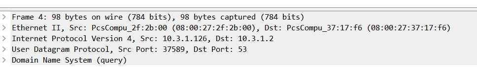
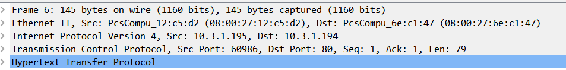
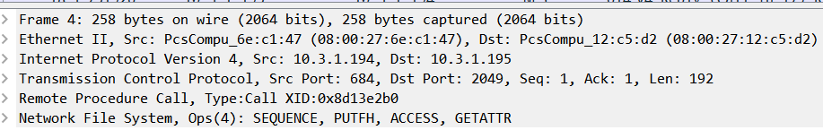
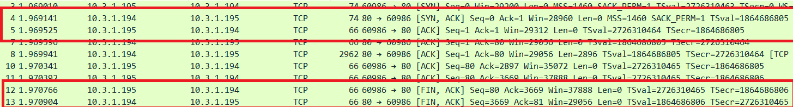

# TP3 : Progressons vers le réseau d'infrastructure

- [TP3 : Progressons vers le réseau d'infrastructure](#tp3--progressons-vers-le-réseau-dinfrastructure)
  - [1. Architecture réseau](#1-architecture-réseau)
  - [2. Création du routeur :](#2-création-du-routeur-)
  - [3. Services d'Infra :](#3-services-dinfra-)
    - [**Serveur DHCP :**](#serveur-dhcp-)
    - [**Serveur DNS :**](#serveur-dns-)
    - [**We Need to go deeper :**](#we-need-to-go-deeper-)
  - [4. Services Métier :](#4-services-métier-)
    - [**Service Web :**](#service-web-)
    - [**Service de Partage de fichiers :**](#service-de-partage-de-fichiers-)
  - [5. TCP - UDP :](#5-tcp---udp-)
  - [5. Schéma Final :](#5-schéma-final-)


## 1. Architecture réseau

Pour commencer sur l'infrastructure, voici une table des réseau :

| Nom du réseau | Adresse du réseau | Masque            | Nombre de clients possibles | Adresse passerelle | Adresse Broadcast |
| ------------- | ----------------- | ----------------- | --------------------------- | ------------------ | ----------------- |
| `client1`     | `10.3.1.128`      | `255.255.255.192` | 62                          | `10.3.1.190`       | `10.3.1.191`      |
| `server1`     | `10.3.1.0`        | `255.255.255.128` | 126                         | `10.3.1.126`       | `10.3.1.127`      |
| `server2`     | `10.3.1.192`      | `255.255.255.240` | 14                          | `10.3.1.206`       | `10.3.1.207`      |

Ainsi que le début du tableau d'adressage : 

| Nom machine  | Adresse IP `client1` | Adresse IP `server1` | Adresse IP `server2` | Adresse de passerelle |
| ------------ | -------------------- | -------------------- | -------------------- | --------------------- |
| `router.tp3` | `10.3.1.190/26`      | `10.3.1.126/25`      | `10.3.1.206/28`      | Carte NAT             |
| ...          | ...                  | ...                  | ...                  | `10.3.?.?/?`          |

## 2. Création du routeur :  

**Le Routeur doit avoir :**  

- Une IP dans chaque réseau :  

```
[lack@router ~]$ ip a
[...]
3: enp0s8: <BROADCAST,MULTICAST,UP,LOWER_UP> mtu 1500 qdisc fq_codel state UP group default qlen 1000
    link/ether 08:00:27:82:92:4f brd ff:ff:ff:ff:ff:ff
    inet 10.3.1.190/26 brd 10.3.1.191 scope global noprefixroute enp0s8
       valid_lft forever preferred_lft forever
    inet6 fe80::a00:27ff:fe82:924f/64 scope link noprefixroute
       valid_lft forever preferred_lft forever
4: enp0s9: <BROADCAST,MULTICAST,UP,LOWER_UP> mtu 1500 qdisc fq_codel state UP group default qlen 1000
    link/ether 08:00:27:2f:2b:00 brd ff:ff:ff:ff:ff:ff
    inet 10.3.1.126/25 brd 10.3.1.127 scope global noprefixroute enp0s9
       valid_lft forever preferred_lft forever
    inet6 fe80::a00:27ff:fe2f:2b00/64 scope link
       valid_lft forever preferred_lft forever
5: enp0s10: <BROADCAST,MULTICAST,UP,LOWER_UP> mtu 1500 qdisc fq_codel state UP group default qlen 1000
    link/ether 08:00:27:1d:00:95 brd ff:ff:ff:ff:ff:ff
    inet 10.3.1.206/28 brd 10.3.1.207 scope global noprefixroute enp0s10
       valid_lft forever preferred_lft forever
    inet6 fe80::a00:27ff:fe1d:95/64 scope link
       valid_lft forever preferred_lft forever
```

> Les IP de enp0s8, enp0s9 et enp0s10 correspondent bien aux IP des passerelles indiquées dans la table des réseau.

- Un accès à internet :  

```
[lack@router ~]$ ping 8.8.8.8 -c 2
PING 8.8.8.8 (8.8.8.8) 56(84) bytes of data.
64 bytes from 8.8.8.8: icmp_seq=1 ttl=114 time=108 ms
64 bytes from 8.8.8.8: icmp_seq=2 ttl=114 time=62.1 ms

--- 8.8.8.8 ping statistics ---
2 packets transmitted, 2 received, 0% packet loss, time 1002ms
rtt min/avg/max/mdev = 62.132/84.976/107.821/22.846 ms
```

> Le ping 8.8.8.8 (dns de google) permet de confirmer l'accès à internet.

- Une résolution de nom :  

```
[lack@router ~]$ dig ynov.com

; <<>> DiG 9.11.26-RedHat-9.11.26-4.el8_4 <<>> ynov.com
;; global options: +cmd
;; Got answer:
;; ->>HEADER<<- opcode: QUERY, status: NOERROR, id: 52145
;; flags: qr rd ra; QUERY: 1, ANSWER: 1, AUTHORITY: 0, ADDITIONAL: 1

;; OPT PSEUDOSECTION:
; EDNS: version: 0, flags:; udp: 4000
;; QUESTION SECTION:
;ynov.com.                      IN      A

;; ANSWER SECTION:
ynov.com.               2860    IN      A       92.243.16.143

;; Query time: 6 msec
;; SERVER: 10.33.10.2#53(10.33.10.2)
;; WHEN: Wed Sep 29 15:37:16 CEST 2021
;; MSG SIZE  rcvd: 53
```

> La résolution de nom est fonctionnelle, on pourrait préciser ça en faisant un ping vers un nom de domaine (google.com, ect) pour prouver le fonctionnement.

- Le nom `router.tp3` :  

```
[lack@router ~]$ hostname
router.tp3
```

Pour finir on active le routage avec `firewall-cmd`.

---

## 3. Services d'Infra :  

### **Serveur DHCP :**

Le fichier de configuration du DHCP est dans `./captures/dhcpd.conf`

> (on active le démarrage automatique avec `sudo systemctl enable dhcpd`)

Test du DHCP : 

On crée la machine `marcel.client1.tp3` pour tester le dhcp.

IP et fichier de conf de la carte réseau :  

```
[lack@marcel ~]$ ip a
1: lo: <LOOPBACK,UP,LOWER_UP> mtu 65536 qdisc noqueue state UNKNOWN group default qlen 1000
   [...]
2: enp0s8: <BROADCAST,MULTICAST,UP,LOWER_UP> mtu 1500 qdisc fq_codel state UP group default qlen 1000
    link/ether 08:00:27:b2:87:ec brd ff:ff:ff:ff:ff:ff
    inet 10.3.1.131/26 brd 10.3.1.191 scope global dynamic noprefixroute enp0s8
       valid_lft 579sec preferred_lft 579sec
    inet6 fe80::a00:27ff:feb2:87ec/64 scope link noprefixroute
       valid_lft forever preferred_lft forever
[lack@marcel ~]$ cat /etc/sysconfig/network-scripts/ifcfg-enp0s8
TYPE=Ethernet
BOOTPROTO=dhcp
DEFROUTE=yes
NAME=enp0s8
DEVICE=enp0s8
ONBOOT=yes
```

Ping 8.8.8.8 pour tester l'accès a internet :  

```
[lack@marcel ~]$ ping 8.8.8.8 -c 2
PING 8.8.8.8 (8.8.8.8) 56(84) bytes of data.
64 bytes from 8.8.8.8: icmp_seq=1 ttl=113 time=19.3 ms
64 bytes from 8.8.8.8: icmp_seq=2 ttl=113 time=41.7 ms

--- 8.8.8.8 ping statistics ---
2 packets transmitted, 2 received, 0% packet loss, time 1002ms
rtt min/avg/max/mdev = 19.312/30.524/41.737/11.213 ms
```

Dig google.com pour tester la résolution de noms :  

```
[lack@marcel ~]$ dig google.com

; <<>> DiG 9.11.26-RedHat-9.11.26-4.el8_4 <<>> google.com
;; global options: +cmd
;; Got answer:
;; ->>HEADER<<- opcode: QUERY, status: NOERROR, id: 24612
;; flags: qr rd ra; QUERY: 1, ANSWER: 1, AUTHORITY: 0, ADDITIONAL: 1

;; OPT PSEUDOSECTION:
; EDNS: version: 0, flags:; udp: 1232
;; QUESTION SECTION:
;google.com.                    IN      A

;; ANSWER SECTION:
google.com.             162     IN      A       142.250.74.238

;; Query time: 39 msec
;; SERVER: 1.1.1.1#53(1.1.1.1)
;; WHEN: Thu Sep 30 14:53:29 CEST 2021
;; MSG SIZE  rcvd: 55
```
Traceroute de google.com pour prouver que la machine passe bien par le routeur :  

```
[lack@marcel ~]$ traceroute google.com
traceroute to google.com (142.250.179.110), 30 hops max, 60 byte packets
 1  _gateway (10.3.1.190)  1.093 ms  1.044 ms  1.024 ms
 2  10.0.2.2 (10.0.2.2)  0.954 ms  0.927 ms  0.861 ms
 3  * * *
 [...]
```

---

### **Serveur DNS :**

On test le DNS sur `marcel.client1.tp3` après avoir préciser le nameserver à utiliser dans `/etc/resolv.conf` :  

```
[lack@marcel ~]$ dig router.server1.tp3

; <<>> DiG 9.11.26-RedHat-9.11.26-4.el8_4 <<>> router.server1.tp3
;; global options: +cmd
;; Got answer:
;; ->>HEADER<<- opcode: QUERY, status: NOERROR, id: 45769
;; flags: qr aa rd ra; QUERY: 1, ANSWER: 1, AUTHORITY: 1, ADDITIONAL: 2

;; OPT PSEUDOSECTION:
; EDNS: version: 0, flags:; udp: 1232
;; QUESTION SECTION:
;router.server1.tp3.            IN      A

;; ANSWER SECTION:
router.server1.tp3.     86400   IN      A       10.3.1.126

;; AUTHORITY SECTION:
server1.tp3.            86400   IN      NS      dns1.server1.tp3.

;; ADDITIONAL SECTION:
dns1.server1.tp3.       86400   IN      A       10.1.3.2

;; Query time: 0 msec
;; SERVER: 10.3.1.2#53(10.3.1.2)
;; WHEN: Mon Oct 04 21:47:38 CEST 2021
;; MSG SIZE  rcvd: 126
```

On teste ensuite la zone forward avec un `ping <Nom>` :  

```
[lack@marcel ~]$ ping router.server1.tp3 -c 2
PING router.server1.tp3 (10.3.1.126) 56(84) bytes of data.
64 bytes from 10.3.1.126 (10.3.1.126): icmp_seq=1 ttl=64 time=0.283 ms
64 bytes from 10.3.1.126 (10.3.1.126): icmp_seq=2 ttl=64 time=0.565 ms

--- router.server1.tp3 ping statistics ---
2 packets transmitted, 2 received, 0% packet loss, time 1002ms
rtt min/avg/max/mdev = 0.283/0.424/0.565/0.141 ms
```

Dans les résultats du dig fait au dessus on peut voir dans la section `;; SERVER : 10.3.1.2#53` que c'est bien notre serveur DNS qui réponds.

> Pour la Configuration du DNS sur les serveurs puis les clients on va faire ça manuellement dans le `/etc/resolv.conf` pour les serveurs et automatiquement via le DHCP pour les clients.

Option du DHCP :  

```
subnet 10.3.1.128 netmask 255.255.255.192 {
        range dynamic-bootp 10.3.1.131 10.3.1.189;
        option routers 10.3.1.190;
        option domain-name-servers 10.1.3.2;
}
```

L'option `domain-name-servers` permettra de préciser le DNS à utiliser par défaut lors de l'ajout de nouvelles machines.

---

### **We Need to go deeper :**

Configuration du DNS pour qu'il soit un Forwarder :  

> Le but est de transmettre la requête à un autre serveur dns si il n'arrive pas a résoudre un nom (8.8.8.8, 8.8.4.4, ect)

Ajout des options dans `named.conf` :  

```
options {
        listen-on port 53 { any; };
        listen-on-v6 port 53 { ::1; };
        directory       "/var/named";
        dump-file       "/var/named/data/cache_dump.db";
        statistics-file "/var/named/data/named_stats.txt";
        memstatistics-file "/var/named/data/named_mem_stats.txt";
        secroots-file   "/var/named/data/named.secroots";
        recursing-file  "/var/named/data/named.recursing";
        allow-query      { any; };
        #allow-query     { localhost; 10.1.3.0/25; 10.3.1.192/28; };
        recursion yes;

        forwarders {
                8.8.8.8;
                8.8.4.4;
        };
        forward only;

        dnssec-enable yes;
        dnssec-validation yes;
        [...]
}
```

L'ajout de `forwarders {...}` permet de relayer la requête si elle n'est pas résolue. `forward only;` permet d'éviter que le serveur essaie de résoudre des noms qu'il ne connais pas, il va directement relayer la requête.

On teste le tout avec un `dig google.com` et un `dig router.server1.tp3` pour être sur que notre DNS résoud encore les noms qu'il connait :  

```
[lack@marcel ~]$ dig google.com

; <<>> DiG 9.11.26-RedHat-9.11.26-4.el8_4 <<>> google.com
;; global options: +cmd
;; Got answer:
;; ->>HEADER<<- opcode: QUERY, status: NOERROR, id: 46035
;; flags: qr rd ra; QUERY: 1, ANSWER: 1, AUTHORITY: 0, ADDITIONAL: 1

;; OPT PSEUDOSECTION:
; EDNS: version: 0, flags:; udp: 1232
; COOKIE: a36adc5396c13649ea0091e3615b6023977fb037a625e62b (good)
;; QUESTION SECTION:
;google.com.                    IN      A

;; ANSWER SECTION:
google.com.             242     IN      A       142.250.179.110

;; Query time: 66 msec
;; SERVER: 10.3.1.2#53(10.3.1.2)
;; WHEN: Mon Oct 04 22:12:18 CEST 2021
;; MSG SIZE  rcvd: 83

----------------------------------------------------------------------------

[lack@marcel ~]$ dig router.server1.tp3

; <<>> DiG 9.11.26-RedHat-9.11.26-4.el8_4 <<>> router.server1.tp3
;; global options: +cmd
;; Got answer:
;; ->>HEADER<<- opcode: QUERY, status: NOERROR, id: 48000
;; flags: qr aa rd ra; QUERY: 1, ANSWER: 1, AUTHORITY: 1, ADDITIONAL: 2

;; OPT PSEUDOSECTION:
; EDNS: version: 0, flags:; udp: 1232
; COOKIE: 0c527e966ee8aa6fcefe9532615b603220baea9d2d61dd1d (good)
;; QUESTION SECTION:
;router.server1.tp3.            IN      A

;; ANSWER SECTION:
router.server1.tp3.     86400   IN      A       10.3.1.126

;; AUTHORITY SECTION:
server1.tp3.            86400   IN      NS      dns1.server1.tp3.

;; ADDITIONAL SECTION:
dns1.server1.tp3.       86400   IN      A       10.1.3.2

;; Query time: 1 msec
;; SERVER: 10.3.1.2#53(10.3.1.2)
;; WHEN: Mon Oct 04 22:12:33 CEST 2021
;; MSG SIZE  rcvd: 126
```

> Les deux dig fonctionnent, et ils ont été tout les deux traités par notre serveur DNS (10.1.3.2)

---

On va tester tout ça en créant une nouvelle machine client, `johnny.client1.tp3`, on verra si notre DHCP donne le bon DNS par défaut, qu'il donne une ip, et que l'hôte peut utiliser le DNS.

On teste ça avec un `ping google.com`, un `ping router.server1.tp3` et un `dig router.server1.tp3` :  

```
[lack@johnny ~]$ ping google.com -c 2
PING google.com (142.250.201.174) 56(84) bytes of data.
64 bytes from par21s23-in-f14.1e100.net (142.250.201.174): icmp_seq=1 ttl=114 time=15.9 ms
64 bytes from par21s23-in-f14.1e100.net (142.250.201.174): icmp_seq=2 ttl=114 time=20.7 ms

--- google.com ping statistics ---
2 packets transmitted, 2 received, 0% packet loss, time 1003ms
rtt min/avg/max/mdev = 15.915/18.328/20.741/2.413 ms
-------------------------------------------------------------------------
[lack@johnny ~]$ ping router.server1.tp3 -c 2
PING router.server1.tp3 (10.3.1.126) 56(84) bytes of data.
64 bytes from 10.3.1.126 (10.3.1.126): icmp_seq=1 ttl=64 time=0.231 ms
64 bytes from 10.3.1.126 (10.3.1.126): icmp_seq=2 ttl=64 time=0.339 ms

--- router.server1.tp3 ping statistics ---
2 packets transmitted, 2 received, 0% packet loss, time 1002ms
rtt min/avg/max/mdev = 0.231/0.285/0.339/0.054 ms
-------------------------------------------------------------------------
[lack@johnny ~]$ dig router.server1.tp3

; <<>> DiG 9.11.26-RedHat-9.11.26-4.el8_4 <<>> router.server1.tp3
;; global options: +cmd
;; Got answer:
;; ->>HEADER<<- opcode: QUERY, status: NOERROR, id: 36356
;; flags: qr aa rd ra; QUERY: 1, ANSWER: 1, AUTHORITY: 1, ADDITIONAL: 2

;; OPT PSEUDOSECTION:
; EDNS: version: 0, flags:; udp: 1232
; COOKIE: ff519d3402fb427c16f783de615b640a79bc14a80df117cc (good)
;; QUESTION SECTION:
;router.server1.tp3.            IN      A

;; ANSWER SECTION:
router.server1.tp3.     86400   IN      A       10.3.1.126

;; AUTHORITY SECTION:
server1.tp3.            86400   IN      NS      dns1.server1.tp3.

;; ADDITIONAL SECTION:
dns1.server1.tp3.       86400   IN      A       10.1.3.2

;; Query time: 0 msec
;; SERVER: 10.3.1.2#53(10.3.1.2)
;; WHEN: Mon Oct 04 22:28:58 CEST 2021
;; MSG SIZE  rcvd: 126
```

Et voilà ! Notre nouveau client a une IP attribuée par le DHCP, le dns précisé de base est le bon, et tout fonctionne correctement !

---

## 4. Services Métier :  

### **Service Web :**  

Après avoir installer NGINX on configure le firewall pour laisser passer le flux http/https :

```
[lack@web1 ~]$ sudo firewall-cmd --permanent --list-all
public
  target: default
  icmp-block-inversion: no
  interfaces:
  sources:
  services: cockpit dhcpv6-client ssh
  ports: 80/tcp 443/tcp
  protocols:
  masquerade: no
```

Démarre le service et on teste depuis `marcel.client1.tp3` :  

```
[lack@marcel ~]$ curl 10.3.1.194:80
<!DOCTYPE html>
<html xmlns="http://www.w3.org/1999/xhtml" xml:lang="en">
  <head>
    <title>Test Page for the Nginx HTTP Server on Rocky Linux</title>
    <meta http-equiv="Content-Type" content="text/html; charset=UTF-8" />
  </head>
  <body>
    <h1>Welcome to <strong>nginx</strong> on Rocky Linux!</h1>
    <div class="content">
      <p>
        This page is used to test the proper operation of the
        <strong>nginx</strong> HTTP server after it has been installed. If you
        can read this page, it means that the web server installed at this site
        is working properly.
      </p>
      <div class="alert">
        <h2>Website Administrator</h2>
        <div class="content">
          <p>
            This is the default <tt>index.html</tt> page that is distributed
            with <strong>nginx</strong> on Rocky Linux. It is located in
            <tt>/usr/share/nginx/html</tt>.
          </p>
          <p>
            You should now put your content in a location of your choice and
            edit the <tt>root</tt> configuration directive in the
            <strong>nginx</strong>
            configuration file
            <tt>/etc/nginx/nginx.conf</tt>.
          </p>
          <p>
            For information on Rocky Linux, please visit the
            <a href="https://www.rockylinux.org/">Rocky Linux website</a>
            The documentation for Rocky Linux is
            <a href="https://www.rockylinux.org/">
            available on the Rocky Linux website
            </a>
          </p>
        </div>
      </div>
    </div>
  </body>
</html>
```

Le curl fonctionne, notre server web est fonctionnel !

### **Service de Partage de fichiers :**

- Config sur le serveur NFS :  

On configure `idmapd.conf` :  

```
[lack@nfs1 ~]$ sudo cat /etc/idmapd.conf | grep Domain
Domain = server2.tp3
```

On ajoute maintenant un nouveau partage dans le fichier `/etc/exports` :  

```
[lack@nfs1 ~]$ sudo cat /etc/exports
/srv/nfs_share 10.3.1.192/28(rw,no_root_squash)
```

On vérifie que les services sont actif au démarrage :  

```
[lack@nfs1 ~]$ sudo systemctl is-enabled nfs-server rpcbind
enabled
enabled
```

On autorise les port sur le firewall :  

```
[lack@nfs1 ~]$ sudo firewall-cmd --permanent --zone=public --add-port=2049/tcp
success
[lack@nfs1 ~]$ sudo firewall-cmd --reload
success
```

- Maintenant on va passer à la config NFS de `web1.server2.tp3` :  

```
[lack@nfs1 ~]$ cat /etc/idmapd.conf | grep "Domain ="
Domain = server2.tp3
```

On monte le partage NFS sur notre serveur web :  

```
[lack@web1 ~]$ sudo mount -t nfs nfs.server2.tp3:/srv/nfs_share /srv/nfs
```

*Vérification :*

```
[lack@web1 ~]$ df -hT | grep nfs
nfs.server2.tp3:/srv/nfs_share nfs4      6.2G  2.2G  4.1G  35% /srv/nfs
```

On ajoute un fichier dans `/srv/nfs/`:  

```
[lack@web1 nfs]$ ls
test.ts
```

Et il est bien présent sur `/srv/nfs_share/` dans notre server nfs :  

```
[lack@nfs1 nfs_share]$ ls
test.ts
```

--------

## 5. TCP - UDP :  

Quels protocoles sont en UDP ou en TCP :  

- DNS :  



Sur cette capture on voit que le DNS est en UDP.

- HTTP :  



Ici, le protocole HTTP utilise le TCP.

- NFS :  



Le NFS utilise aussi le TCP.

- SSH :  

  

Le SSH utilise le TCP.

> Le TCP utilise la méthode du 3ways handshake, on va essayer d'en capturer un.

- Capture d'un 3ways handshake.



On voit bien le [SYN], [SYN, ACK], [ACK] *et [FIN, ACK]*.

---

## 5. Schéma Final : 

