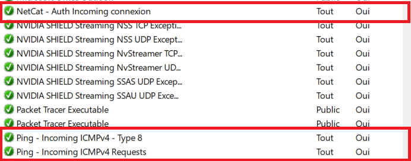
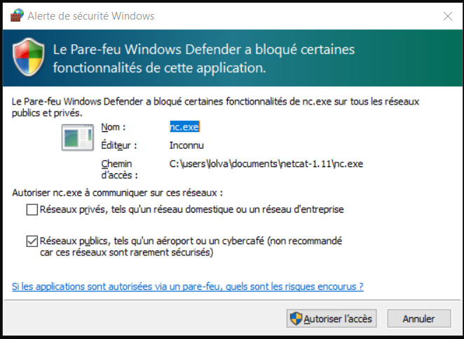
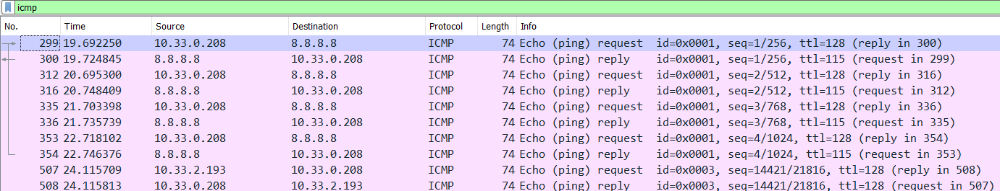
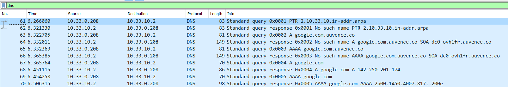
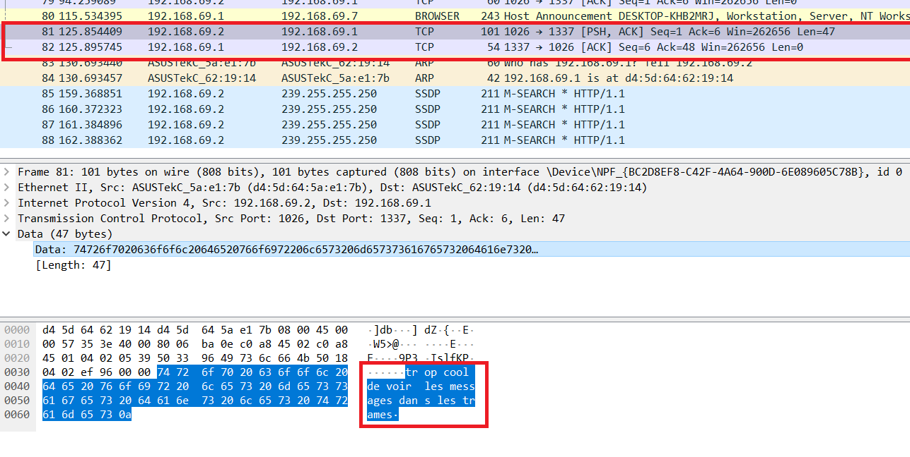

# TP1 -- Réseaux B2 2021

## Exploration Locale en Solo

## 1 - Affichage d'informations sur la pile TCP/IP locale  

### En ligne de commande  

*Dans le powershell :*  
Commande : `PS C:\Users\lolva> ipconfig -all`  
Résultat de la commande :  

```
[...]
Carte réseau sans fil Wi-Fi :

   Suffixe DNS propre à la connexion. . . : auvence.co
   Description. . . . . . . . . . . . . . : Realtek 8822CE Wireless LAN 802.11ac PCI-E NIC
   Adresse physique . . . . . . . . . . . : 70-66-55-C5-4E-29
   Adresse IPv4. . . . . . . . . . . . . .: 10.33.0.208(préféré)
[...]
Carte Ethernet Ethernet :

   Statut du média. . . . . . . . . . . . : Média déconnecté
   Suffixe DNS propre à la connexion. . . :
   Description. . . . . . . . . . . . . . : Realtek PCIe GbE Family Controller
   Adresse physique . . . . . . . . . . . : D4-5D-64-62-19-14
```  

La carte Ethernet n'étant pas utilisée actuellement, elle ne possède pas d'adresse IP.  

Passerelle (dans la commande `ipconfig -all`): 
```
Carte réseau sans fil Wi-Fi : [...]
    Passerelle par défaut. . . . . . . . . : 10.33.3.253
```
---
### En Interface Graphique  

Dans le panneau de configuration, partie 'Réseau et Internet' on peut trouver les informations suivantes :  
  


Le gateway (ou passerelle) nous permet, sur le réseau Ynov, de communiquer avec les machines des autres LAN et notamment avec Internet.

---

## 2 - Modifications des informations

### Modification d'adresse IP :  

Changement de l'adresse IP de la carte wifi manuellement :  
  


Il est possible qu'en faisant cette manipulation, on perde l'accès à internet. La passerelle pourrait ne pas donner l'accès a des IP que le serveur DHCP n'a pas attribué.

### Table ARP :  

Commande : `PS C:\Users\lolva> arp -a`  
Résultat de la commande :  

```
Interface : 10.33.0.208 --- 0xc
  Adresse Internet      Adresse physique      Type
  10.33.2.190           74-4c-a1-d8-e6-03     dynamique
  10.33.3.253           00-12-00-40-4c-bf     dynamique
  10.33.3.254           00-0e-c4-cd-74-f5     dynamique
  10.33.3.255           ff-ff-ff-ff-ff-ff     statique
  224.0.0.22            01-00-5e-00-00-16     statique
  224.0.0.251           01-00-5e-00-00-fb     statique
  224.0.0.252           01-00-5e-00-00-fc     statique
  239.255.255.250       01-00-5e-7f-ff-fa     statique
  255.255.255.255       ff-ff-ff-ff-ff-ff     statique
```

L'adresse MAC de la passerelle est `00-12-00-40-4c-bf`, pour récuperer cette adresse MAC j'ai fait le lien entre l'IP que j'ai trouvé dans les détails de la carte WIFI.

Ping des IP randoms :  
```
  10.33.3.100           2a-84-55-56-76-ea     dynamique
  10.33.3.109           38-f9-d3-2f-c2-79     dynamique
  10.33.3.112           3c-06-30-2d-48-0d     dynamique
```  
---

### NMAP :  

Table ARP après le scan ping NMAP :  
Commande : `arp -a`  
Résultat : 
```
Interface : 10.33.0.208 --- 0xc
  Adresse Internet      Adresse physique      Type
  10.33.0.3             22-93-d2-7e-9f-1a     dynamique
  10.33.0.197           14-7d-da-10-65-78     dynamique
  10.33.0.244           ce-3d-70-5e-c8-db     dynamique
  10.33.1.93            b8-9a-2a-3d-c1-1a     dynamique
  10.33.2.10            84-fd-d1-10-23-45     dynamique
  10.33.2.14            84-fd-d1-10-23-45     dynamique
  10.33.2.64            90-9c-4a-ba-53-f6     dynamique
  10.33.2.100           84-fd-d1-10-23-45     dynamique
  10.33.2.101           18-56-80-cc-ea-3e     dynamique
  10.33.2.188           d8-f3-bc-c2-f5-39     dynamique
  10.33.2.209           5c-87-9c-e4-44-2c     dynamique
  10.33.2.237           be-fd-16-82-f4-05     dynamique
  10.33.3.13            26-7b-3f-46-6d-9e     dynamique
  10.33.3.23            7e-7e-4e-bb-23-88     dynamique
  10.33.3.24            ac-12-03-2e-e4-92     dynamique
  10.33.3.48            f8-ac-65-da-00-c5     dynamique
  10.33.3.187           96-fd-87-13-4b-ee     dynamique
  10.33.3.253           00-12-00-40-4c-bf     dynamique
  10.33.3.255           ff-ff-ff-ff-ff-ff     statique
  224.0.0.22            01-00-5e-00-00-16     statique
  224.0.0.251           01-00-5e-00-00-fb     statique
  224.0.0.252           01-00-5e-00-00-fc     statique
  239.255.255.250       01-00-5e-7f-ff-fa     statique
  255.255.255.255       ff-ff-ff-ff-ff-ff     statique
```  

IP choisie : `10.33.3.10`

---

### Modification de l'adresse IP (après nmap) :  

On effectue un scan ping nmap sur YNOV mais il ne se passe rien car le gateway n'est pas configuré :  
```
PS C:\Users\lolva\Documents\nmap-7.92> .\nmap -sP 10.33.0.0/22
Starting Nmap 7.92 ( https://nmap.org ) at 2021-09-13 17:21 Paris, Madrid (heure dÆÚtÚ)
PS C:\Users\lolva\Documents\nmap-7.92>
```  

Après avoir configurer l'adresse IP manuellement, on peut vérifier le fonctionnement avec la commande `ipconfig -all` puis `ping 8.8.8.8` pour l'accès à internet.  
*résultat du `ipconfig -all` :*  

```
Carte réseau sans fil Wi-Fi :

   Suffixe DNS propre à la connexion. . . :
   Description. . . . . . . . . . . . . . : Realtek 8822CE Wireless LAN 802.11ac PCI-E NIC
   Adresse physique . . . . . . . . . . . : 70-66-55-C5-4E-29
   DHCP activé. . . . . . . . . . . . . . : Non
   Configuration automatique activée. . . : Oui
   Adresse IPv6 de liaison locale. . . . .: fe80::291b:6ee8:46c0:a818%12(préféré)
   Adresse IPv4. . . . . . . . . . . . . .: 10.33.3.10(préféré)
   Masque de sous-réseau. . . . . . . . . : 255.0.0.0
   Passerelle par défaut. . . . . . . . . : 10.33.3.253
```

*résultat du `ping 8.8.8.8` :*  

```
PS C:\Users\lolva\Documents\nmap-7.92> ping 8.8.8.8

Envoi d’une requête 'Ping'  8.8.8.8 avec 32 octets de données :
    Réponse de 8.8.8.8 : octets=32 temps=53 ms TTL=115
    Réponse de 8.8.8.8 : octets=32 temps=68 ms TTL=115
    Réponse de 8.8.8.8 : octets=32 temps=86 ms TTL=115
    Réponse de 8.8.8.8 : octets=32 temps=25 ms TTL=115

Statistiques Ping pour 8.8.8.8:
    Paquets : envoyés = 4, reçus = 4, perdus = 0 (perte 0%),
Durée approximative des boucles en millisecondes :
    Minimum = 25ms, Maximum = 86ms, Moyenne = 58ms
```

On voit donc que la configuration de l'IP manuellement est valide.

---

## Exploration Locale en Duo

## 1 - Modification d'adresse IP

Changement des adresse IP sur les pc du réseau et vérification avec un ping des deux cotés et grace à la table ARP :

Commande `> ipconfig -all`  
Résultat :  
```
Carte Ethernet Ethernet :

   Adresse physique . . . . . . . . . . . : D4-5D-64-62-19-14
   DHCP activé. . . . . . . . . . . . . . : Non
   Configuration automatique activée. . . : Oui
   Adresse IPv4. . . . . . . . . . . . . .: 192.168.69.1(préféré)
   Masque de sous-réseau. . . . . . . . . : 255.255.255.252
   Passerelle par défaut. . . . . . . . . :
```
L'ip de l'autre machine du réseau est bien 192.168.69.2 :  
Commande `> ping 192.168.69.2`  
Résultat :  
```
Envoi d’une requête 'Ping'  192.168.69.2 avec 32 octets de données :
Réponse de 192.168.69.2 : octets=32 temps=5 ms TTL=128
Réponse de 192.168.69.2 : octets=32 temps=2 ms TTL=128
Réponse de 192.168.69.2 : octets=32 temps=2 ms TTL=128
Réponse de 192.168.69.2 : octets=32 temps=2 ms TTL=128

Statistiques Ping pour 192.168.69.2:
    Paquets : envoyés = 4, reçus = 4, perdus = 0 (perte 0%),
```

Et pour finaliser la vérification, on regarde la table ARP :
Commande `> arp -a`  
Résultat :  
```
Interface : 192.168.69.1 --- 0x13
  Adresse Internet      Adresse physique      Type
  10.10.1.20            d4-5d-64-5a-e1-7b     dynamique
  192.168.69.2          d4-5d-64-5a-e1-7b     dynamique
  [...]
```

--- 

## 2 - Utilisation d'un des deux comme gateway :  
Après avoir désactivé ma carte WiFi, je configure ma carte ethernet pour utiliser le pc de mon camarade comme gateway
```
Carte réseau sans fil Wi-Fi :

   Statut du média. . . . . . . . . . . . : Média déconnecté
   [...]

Carte Ethernet Ethernet :

   Adresse physique . . . . . . . . . . . : D4-5D-64-62-19-14
   DHCP activé. . . . . . . . . . . . . . : Non
   Configuration automatique activée. . . : Oui
   Adresse IPv4. . . . . . . . . . . . . .: 192.168.69.1(préféré)
   Masque de sous-réseau. . . . . . . . . : 255.255.255.252
   Passerelle par défaut. . . . . . . . . : 192.168.69.2
```

Pour vérifier la connexion à internet, un `ping 8.8.8.8` puis un `traceroute` seront effectués :  
Commande : `ping 8.8.8.8`
Résultat :  
```
ping 8.8.8.8

Envoi d’une requête 'Ping'  8.8.8.8 avec 32 octets de données :
Réponse de 8.8.8.8 : octets=32 temps=22 ms TTL=114
Réponse de 8.8.8.8 : octets=32 temps=24 ms TTL=114
Réponse de 8.8.8.8 : octets=32 temps=20 ms TTL=114
Réponse de 8.8.8.8 : octets=32 temps=68 ms TTL=114

Statistiques Ping pour 8.8.8.8:
    Paquets : envoyés = 4, reçus = 4, perdus = 0 (perte 0%)
```  
  
Commande : `traceroute google.com`  
Résultat : 
```
> tracert google.com

Détermination de l’itinéraire vers google.com [216.58.214.174]
avec un maximum de 30 sauts :

  1    <1 ms     *       <1 ms  LAPTOP-DS2IE5NI.mshome.net [192.168.69.2]
  2     *        *        *     Délai d’attente de la demande dépassé.
  3     8 ms     4 ms     5 ms  10.33.3.253
  4     5 ms     6 ms     3 ms  10.33.10.254
  5     6 ms     3 ms     3 ms  reverse.completel.net [92.103.174.137]
  6     9 ms     8 ms     7 ms  92.103.120.182
  [...]
```

La machine `LAPTOP-DS2IE5NI.mshome.net [192.168.69.2]` est atteinte donc le pc de mon camarade me sert bien de gateway vers Internet.  

---

## 3 - Petit chat privé

Je joue le role du serveur dans le test de netcat :  

```
netcat-1.11> ./nc.exe -l -p 8888
test
test
Je réponds au test !

ahah trop bien
:)
```

On inverse les roles et je joue le role du client :  
```
\netcat-1.11> ./nc.exe 192.168.69.2 8888
Bonjour ! x)
Yo
Wow ! Superbe ce chat !
trop bien
```

## 3.1 - Pour aller plus loin :  

On peut spécifier quelle IP accpeter sur la connexion netcat :  
```
netcat-1.11> ./nc.exe -l -p 8888 192.168.69.2
test
WOOOOOOW SUPER !!!!!!!!!!!!!!!!!!!
```

Si une Ip non spécifiée essaye de se connecter une erreur se produit :  
```
> ./nc.exe -l -p 8888 192.168.69.1
invalid connection to [192.168.69.1] from (UNKNOWN) [192.168.69.2] 1035
```

---

## 4 - Firewall :  

Après avoir configurer le firewall, on test le ping et le netcat : 

**Règles de configuration du firewall :**  



État du firewall :  
```
[...]> Get-NetFirewallProfile
Name                            : Public
Enabled                         : True
DefaultInboundAction            : NotConfigured
DefaultOutboundAction           : NotConfigured
AllowInboundRules               : NotConfigured
AllowLocalFirewallRules         : NotConfigured
AllowLocalIPsecRules            : NotConfigured
AllowUserApps                   : NotConfigured
AllowUserPorts                  : NotConfigured
AllowUnicastResponseToMulticast : NotConfigured
NotifyOnListen                  : True
```

Ping : (sur `192.168.69.2`)  
```
  > ping 192.168.69.2

Envoi d’une requête 'Ping'  192.168.69.2 avec 32 octets de données :
Réponse de 192.168.69.2 : octets=32 temps=2 ms TTL=128
Réponse de 192.168.69.2 : octets=32 temps=2 ms TTL=128
Réponse de 192.168.69.2 : octets=32 temps=2 ms TTL=128
Réponse de 192.168.69.2 : octets=32 temps=2 ms TTL=128
```

NetCat sur le port choisi (1337) :
```
  > ./nc.exe -l -p 1337
Test netcaat !
ouais
trop bien
lourd tout ça
``` 

> Si on utilise un autre port, le firewall va nous demander la confirmation.



---

# Manipulation d'autres outils/protocoles côté client :  

## Exploration du DHCP :  

Récupération de l'adresse IP de serveur DCHP d'Ynov :  
```
Carte réseau sans fil Wi-Fi :
   Adresse physique . . . . . . . . . . . : 70-66-55-C5-4E-29
   DHCP activé. . . . . . . . . . . . . . : Oui
   Adresse IPv6 de liaison locale. . . . .: fe80::291b:6ee8:46c0:a818%12(préféré)
   Adresse IPv4. . . . . . . . . . . . . .: 10.33.0.208(préféré)
   Masque de sous-réseau. . . . . . . . . : 255.255.252.0
   Bail obtenu. . . . . . . . . . . . . . : jeudi 16 septembre 2021 17:04:21
   Bail expirant. . . . . . . . . . . . . : jeudi 16 septembre 2021 19:04:21
   Passerelle par défaut. . . . . . . . . : 10.33.3.253
 [ Serveur DHCP . . . . . . . . . . . . . : 10.33.3.254  ]
```
L'IP du DHCP est 10.33.3.254

> On peut aussi voir la durée du bail du dhcp. Il sera valide jusqu'au : `jeudi 16 septembre 2021 19:04:21`.

PS : Souvent les serveur DHCP ont la dernière adresse du réseau. 

---

## Exploration du DNS : 

Dans un `>ipconfig -all` on peut avoir les serveurs DNS reconnus par ma machine :  

```
Carte réseau sans fil Wi-Fi :

   Suffixe DNS propre à la connexion. . . : auvence.co
   Adresse physique . . . . . . . . . . . : 70-66-55-C5-4E-29
   Adresse IPv4. . . . . . . . . . . . . .: 10.33.0.208(préféré)
   Masque de sous-réseau. . . . . . . . . : 255.255.252.0
   Bail obtenu. . . . . . . . . . . . . . : jeudi 16 septembre 2021 17:04:21
   Bail expirant. . . . . . . . . . . . . : jeudi 16 septembre 2021 19:04:21
   Passerelle par défaut. . . . . . . . . : 10.33.3.253
   Serveur DHCP . . . . . . . . . . . . . : 10.33.3.254
[ Serveurs DNS. . .  . . . . . . . . . . : 10.33.10.2
                                       10.33.10.148
                                       10.33.10.155 ]
```

NsLookup vers `google.com` et `ynov.com` : 

```
    > nslookup google.com
Serveur :   UnKnown
Address:  10.33.10.2

Réponse ne faisant pas autorité :
Nom :    google.com
Addresses:  2a00:1450:4007:817::200e
          142.250.75.238

    > nslookup ynov.com
Serveur :   UnKnown
Address:  10.33.10.2

Réponse ne faisant pas autorité :
Nom :    ynov.com
Address:  92.243.16.143
```

On observe que l'adresse du serveur `UnKnown` correspond à l'adresse IP d'un des serveurs DNS reconnus par notre machine.

**Reverse NsLookup :**  

```
> nslookup 78.74.21.21
Serveur :   UnKnown
Address:  10.33.10.2

Nom :    host-78-74-21-21.homerun.telia.com
Address:  78.74.21.21

PS C:\Users\lolva\Documents\netcat-1.11> nslookup 92.146.54.88
Serveur :   UnKnown
Address:  10.33.10.2

Nom :    apoitiers-654-1-167-88.w92-146.abo.wanadoo.fr
Address:  92.146.54.88
```

> Ici on ping directement les serveurs dns en question.

--- 

## Wireshark : 

**Analyse d'une tram d'un `ping 8.8.8.8` :** 



**Analyse d'une trame d'un `nslookup google.com` :**  



**Analyse de netcat avec Wireshark :**  

Le chat netcat ressemble à ça :  
```
> ./nc.exe -l -p 1337
test
trop cool de voir les messages dans les trames
```
Ci-dessous la trame visualisée avec wireshark :  


